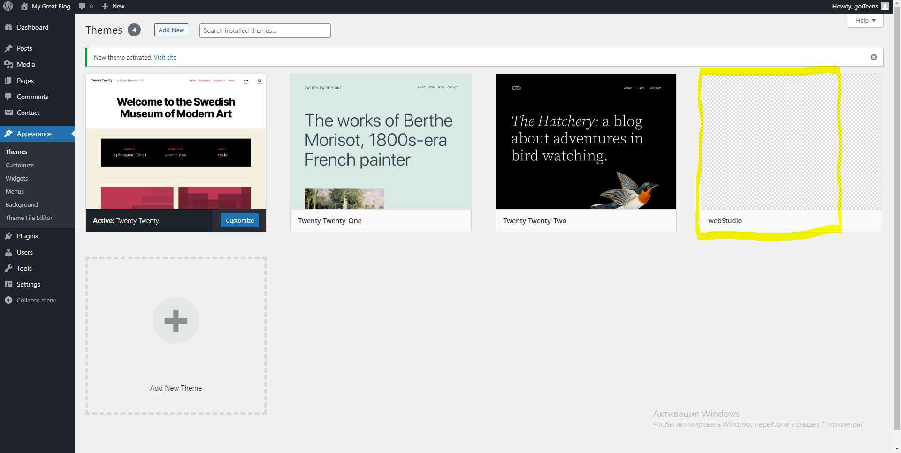
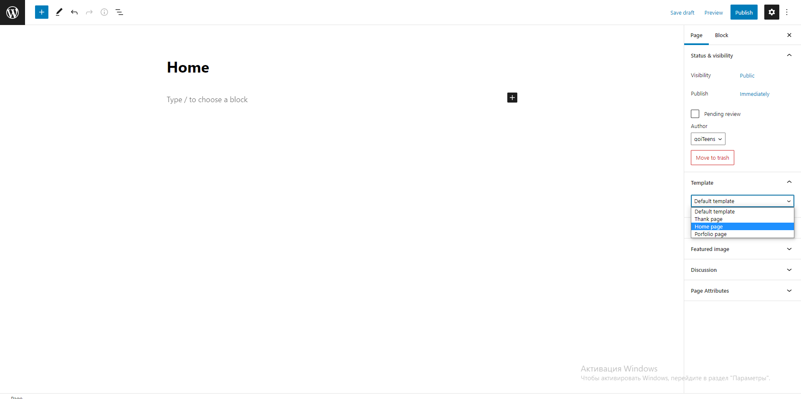
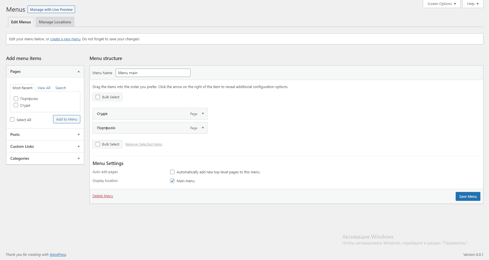

# Як створити wordpress тему використовуючи carbon fields
---
Для створення теми у вас має бути проект з попередньо встановленим wordpress. Для початку нам потрібно створити папку теми, преходем в наш проект, далі в папку wp-content, далі в папку themes і тут створюємо папку теми(називаємо як хочемо). Тема має містити таку структуру:
1.	Папка assets в яку ви скидуєте картинки скріпти шрифти і так далі
2.	Папка includes в яку ви скачуєте плагін з офіційного сайту і в ній папка carbon-fields-options
3.	Пустий файл style.css з таким кодом:
```
/* 
    Theme Name: назва теми
    Theme URI: 
    Author: автор
    Author URI: 
    Description: опис
    Version: 0.0.1
    Tested up to: 5.4
    Requires PHP: 7.1
    License: GNU General Public License v2 or later0
    License URI: LICENSE
    Text Domain: домен
    
    This theme, like WordPress, is licensed under the GPL.
    Use it to make something cool, have fun, and share what you've learned.
*/
```
4.	Інші файли теми які ми створимо такі як header, footer, front-page і файл functions
---
## Як відобразити сторінку на сайті
---
1.	Спочатку потрібно створити файл functions.php, в якому будуть різні конфігурації сайту(вставте його в папку з темою): 
 [приклад](https://drive.google.com/file/d/1H9TTNnKZ_N9yilIUh4bQpr4wsd2MYOBD/view?usp=sharing ) - у функціях site_styles і site_scripts є приклад підключення скриптів і стилів, підключіть свої стилі за прикладом
2.	Далі створимо структуру сайту по шаблону(вставте їх в свою папку теми, в файлах є коментарі): 
[приклад](https://drive.google.com/drive/folders/14GF0LbIAZwQA7IYzCxFjGIJNq-Ho2lUw?usp=sharing )
3.	Заходимо в панель адміністратора та заходимо у вкладку з темами, там обираєм нашу тему 


4.	Заходимо у вкладку сторінки і створюємо головну сторінку


5.  Тиснемо кнопку publish, тепер наш сайт має з’явитися
---
## Як імплементувати сайт
---
1.	В  папку carbon-fields-options додаємо два файла: [приклад](https://drive.google.com/drive/folders/1ht05NOdbJbKQ4DRooYbZeTyNlFQbp0p8?usp=sharing ) - theme options це глобальні поля, а post meta на конкретну сторінку. В carbon fields всі поля групуються контейнерами(тобто для кожної секції потрібно створити окремий контейнер)
2.	Як створити поля, в посиланні що я прикріпив вище є приклад, першим аргументом передається тип, найчастіше використовують:text, image, complex; Текст це текстове поле, image це картинка, а complex це список з полями кількість елементів якого можна змінювати(до нього повернемось пізніше)
3.	Значення полям ми можемо давати в панелі адміністратора коли тиснемо на сторінку, там з’являться наші поля.
4.	Звертаємось ми до полів через ім’я(другий аргумент), а 3 аргумент це як поле  буде відображатись в адмінці
5.	Далі створюємо всі необхідні поля
---
## Як вивести поля
---
#### Для цього в місцях де треба вивести поля потрібно вставити php код: 
Якщо theme options, то:
```<?php echo carbon_get_theme_option('назва поля')?>```

Якщо post meta, то: 
```<?php echo carbon_get_post_meta($page_id, 'назва поля')?>```

---
## Як вивести картинку
---
В post meta або theme options полю ставимо тип image і після поля але перед комою пишемо ```->set_value_type(‘url’)```, таким чином коли ми виведемо поле як написано вище, нам прийде посилання на фото, тобто вивід поля ми вставляємо в атрибут src нашої картинки

---
## Як вивести список(complex)
---

#### Як створити поле
---
``` Field::make( 'complex', 'advantages', 'Список переваг' )
        ->add_fields( array(
            Field::make( 'image', 'advantages_img', 'Картинка' )
            ->set_value_type( 'url' ),
            Field::make( 'text', 'advantages_title', 'Заголовок' ),
        ) ),
```
#### Як вивести поле
---
###### Створенння змінної
```
<?php 
    $page_id = get_the_ID();
    $advantages = carbon_get_post_meta($page_id, 'advantages');
?>
```
---
###### Виведення
```
    <?php if(! empty($advantages)) : ?>
            <ul class="advantages__list">
            <?php foreach($advantages as $advantage) : ?>
                <li class="advantages__item">
      			">
                	<h3><?php echo $advantage['advantages_title']?></h3>
                </li>
            <?php endforeach ?>
            </ul>
     <?php endif ?>
```
---
## Як зробити кілька сторінок
---
1.	За шаблон беремо файл front-page.php, але змінюємо контент, назву і в самому початку файлу міняємо назву шаблона.
2.	Далі створюємо нову сторінку, обираючи цей шаблон
3.	В імпелементації все так само, але в post meta, у контейнера змінюємо де його показувати(пишемо назву файла нової сторінки)
---
## Як зробити меню?
---
1.	Заходимо в адмінку і створюємо нове меню та додаємо потрібні нам сторінки



2.	Виводимо наше меню на сторінку
``` 
   <?php
        wp_nav_menu( array( 
            'theme_location' => '', 
            'container_class' => 'ваш клас' ) ); 
    ?>
```
3.	Змінюємо стилі оскільки wordpress по іншому дає класи, їх можна подивитися, використовуючи devtools
4.	Наше меню готове, і в будь’який момент ми можемо його змінювати не використовуючи код
---
## Заключення
---
Пам’ятайте якщо у вас щось не виходить завжди можна звернутись до документації wordpress та carbon fields там все розписано й показано.
#### Сподіваюсь мій туторіал був корисним!

