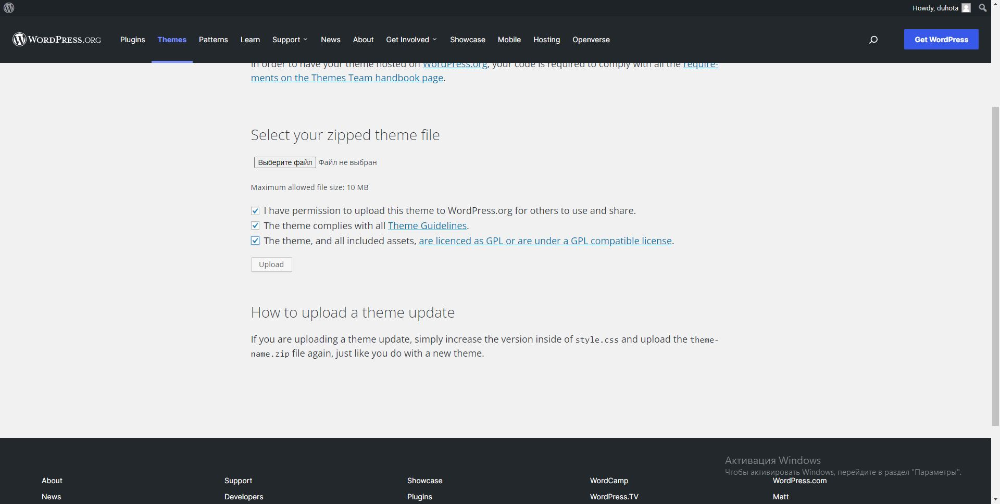

# Як викласти тему у магазин wordpress
---

Для початку нам потрібно перевірити нашу тему на валідність. Це можна зробити за допомогою юніт тесту від розробників wordpress
1.  Для початку встановлюємо файли тесту на комп'ютер: [файл](https://github.com/WPTT/theme-test-data )
2.  Після завантаження переходимо в адмінку нашого сайту: Інструменти => Імпорт => WordPress
3.  Оберіть файл XML на своем компьютере.
4.  Натисніть «Завантажити файл і імпортувати».
5.  У розділі «Імпорт вкладених» активуйте checkbox «Завантажити і імпортувати вкладені файли» та натисніть «Відправити».
Примітка. Можливо, вам доведеться повторювати крок імпорта, поки не з'явиться напис «Все готово», щоб отримати повний список повідомлень і медіафайлів. Ви можете детальніше прочитати про цей тест на офіційному сайті wordpress [тут](https://codex.wordpress.org/Theme_Unit_Test ). Якщо тест сповіститть про помилки, виправте їх і пройдіть тест заново, коли все готово. Заархівуйте вашу тему в архів.

---
## Як відправити тему на модерацію
---

Нам потрібно створити акаунт на сайті wordpress і війти в нього, потім робимо наступні дії :
1.  Переходимо у вкладку themes
2.  Листаємо до самого низу
3.  І клікаємо по посиланню першого елемента списку
4.  На наступній сторінці також листаємо вниз і тиснемо кнопку upload theme
5.  Обираємо файл і пітверджуємо всі checkbox і тиснемо кнопку

6. Далі якщо є помилки виправляємо і завантажуємо знову поки не напише що автоматичний тест пройдений
7. Листаємо донизу якщо там є помилки виправляємо і знову завантажуємо
8. Якщо все прошло успішно вам напише що тему відправили на модерацію і на пошту прийде повідомлення з посиланням де можна подивитись статус перевірки
9.  Залишилось лише чекати

---
## Сподіваюсь мій туторіал був корисним!
